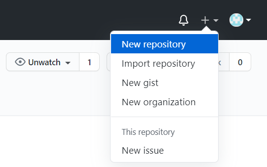
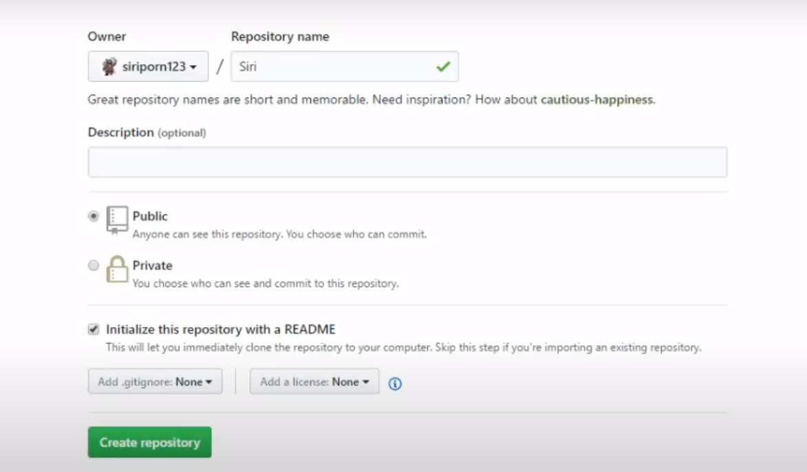
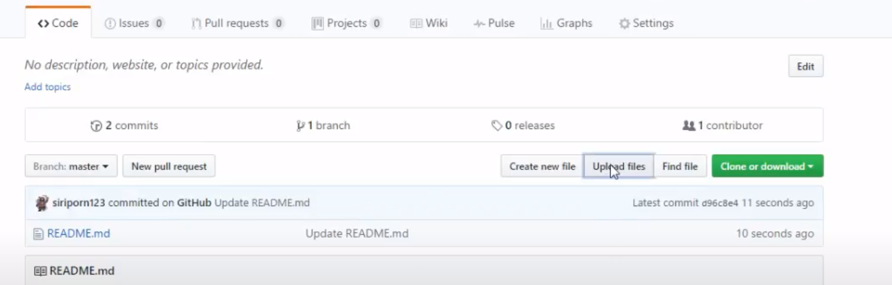
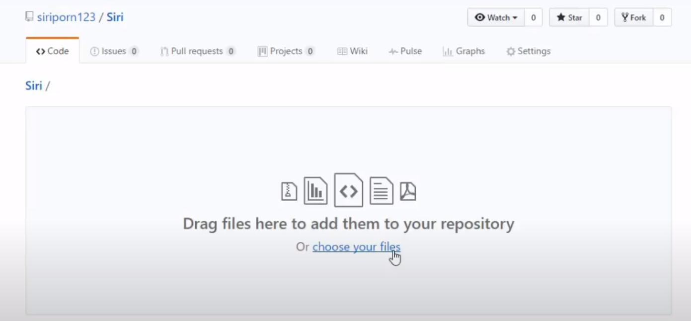
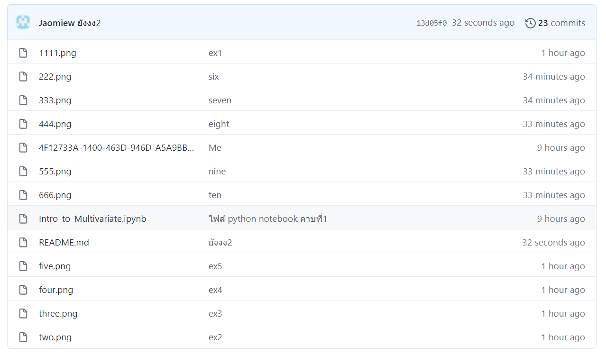

# Multivariate

### วนิศรา จงใจ 623021053-8

.md => Markdown 

[]square brackets

()parentheses

## อธิบายการใช้งาน Github
### 1. ให้ทำการสมัครสมาชิกกับ Github จากนั้นเมื่อสมัครสมาชิกแล้ว เราสามารถที่จะสร้าง Repository ของเราแล้วเอาไปฝากไว้บน Github ได้

### 2. เลือก New repository

### 3. ตั้งชื่อที่ repository แล้วกดเลือกให้เป็น public เสร็จแล้วก็กด Create repository ดังรูปด้านล่างนี้

### 4. เลือก Upload Files เพื่อนำไฟล์โคดมาฝากไว้

### 4.1 เลือก choose your file แล้วเลือกไฟล์ที่เราจะนำมาฝากไว้

### 4.2 จากนั้นกด commit เป็นการเสร็จสิ้น ไฟล์ที่ฝากไว้ก็จะขึ้นมาอยู่หน้านี้

## อธิบายการใช้งาน Google Colab ว่าหน้าที่ของเเต่ละอันคืออะไร 
### 1. New Notebook การสร้างไฟล์ใหม่ 

### 2. +Section สามารถแบ่งโค้ดออกเป็นส่วนๆ

### 3. CODE การเพิ่มช่องสำหรับใส่สคลิปให้กดปุ่ม

### 4. TEXT หากต้องการใส่ข้อความอธิบายใน Notebook  

### 5. Cell หากต้องการย้ายตำแหน่งวัตถุต่างๆ บนหน้าจอให้เลือก  

## อธิบายวิธีเซฟไฟล์จาก Google Colab ลงใน Github

### 1. เลือกไปที่ไฟล์ 

### 2. เลือก Save a copy in GITHUB

### 3. เลือก Projects ของเรา 

### 3.1 อย่าลืมบอกว่าเวอร์ชั่นนี้ของเราเป็นอะไร

### 3.2 จากนั้นกด OK

